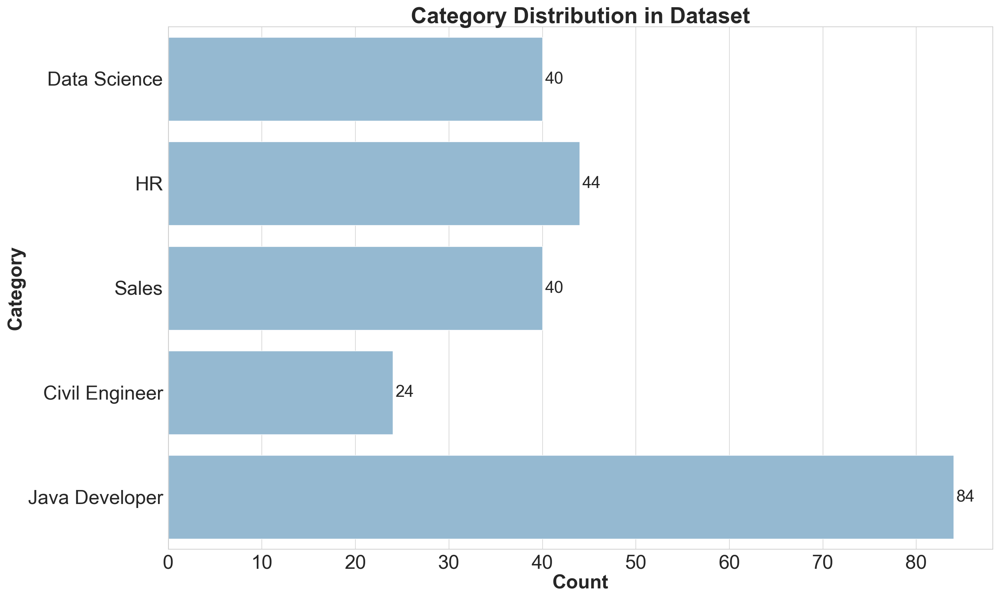
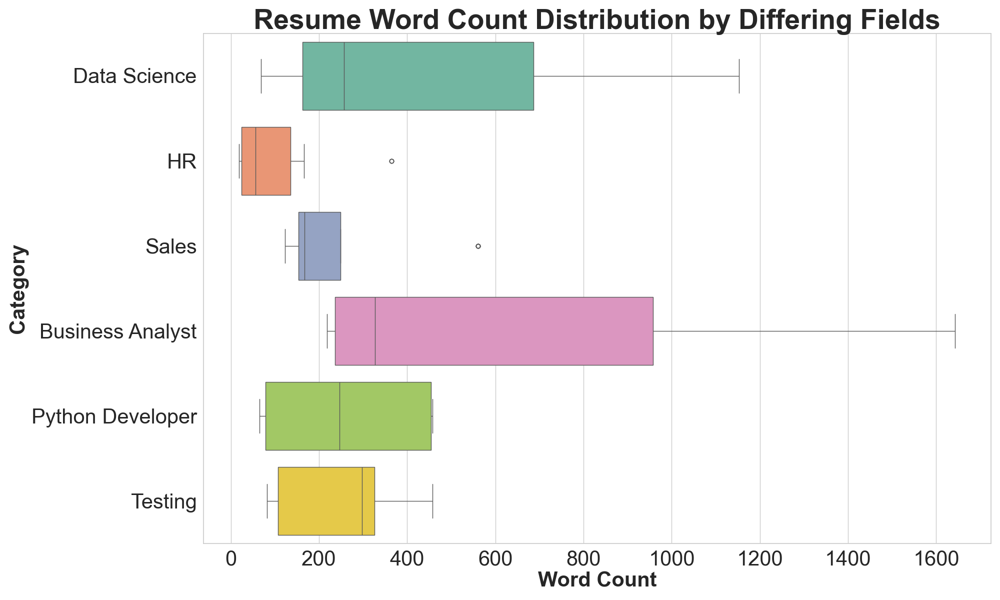
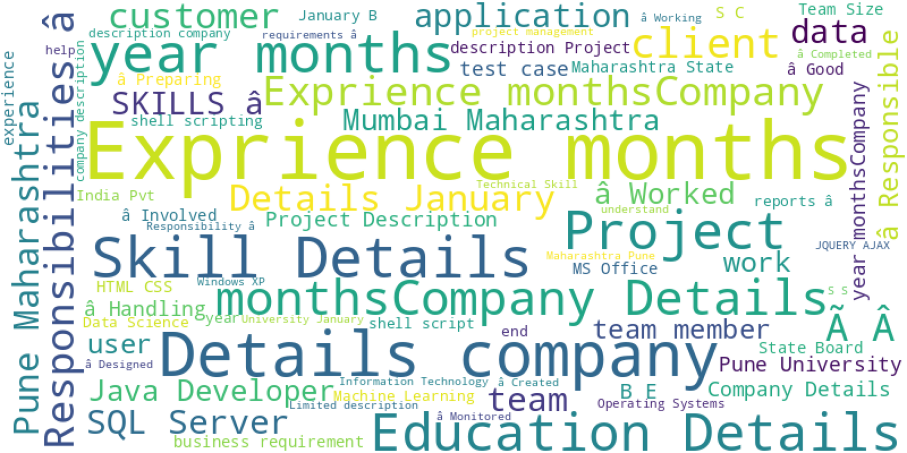
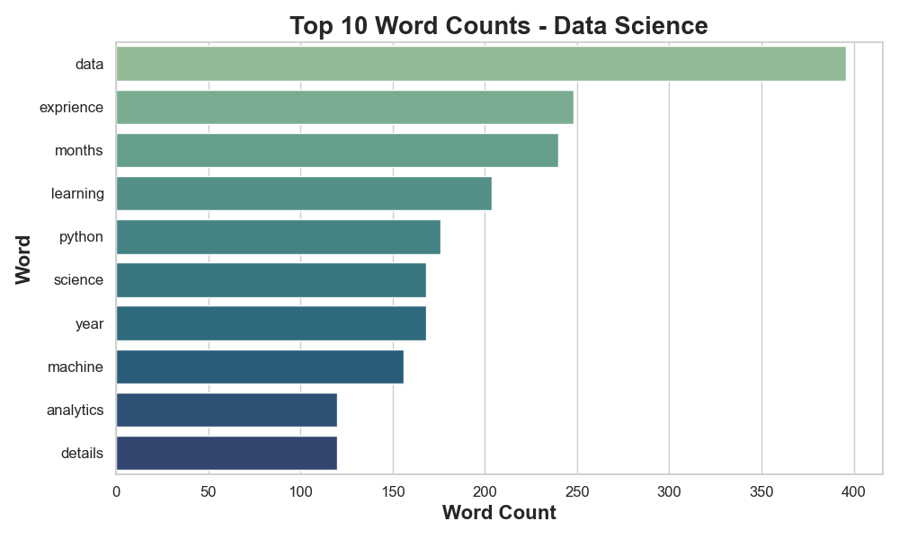
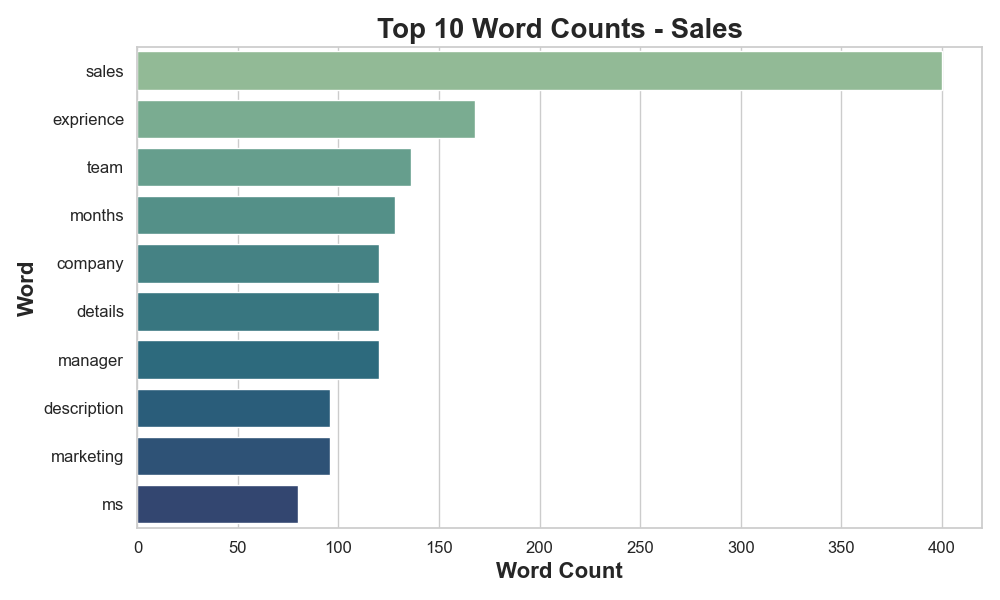
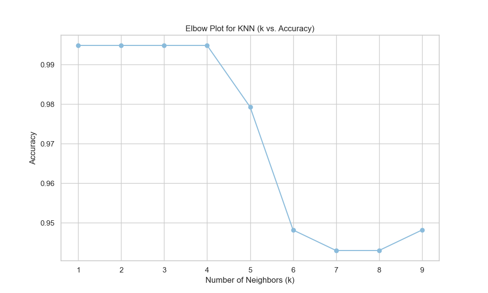
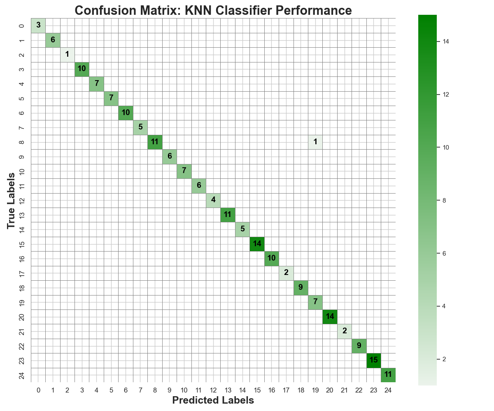
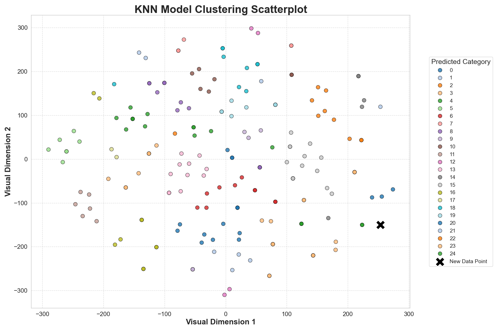

# Job Fit AI Resume Scanner

A high-speed, AI-powered resume screening tool that classifies resumes into 25+ job roles using NLP and K-Nearest Neighbors (KNN). Achieved **99.5% accuracy** with a runtime of **0.1 seconds per resume**, reducing manual screening time by **98.33%** and improving hiring efficiency and consistency.

Dataset: [Updated Resume Dataset on Kaggle](https://www.kaggle.com/datasets/jillanisofttech/updated-resume-dataset)

---

## Table of Contents

- [Problem Statement](#problem-statement)
- [Project Goals](#project-goals)
- [Dataset Overview](#dataset-overview)
- [Data Cleaning & Preprocessing](#data-cleaning--preprocessing)
- [Exploratory Data Analysis (EDA)](#exploratory-data-analysis-eda)
- [Modeling Approach](#modeling-approach)
- [Results & Evaluation](#results--evaluation)
- [Business Impact](#business-impact)
- [Next Steps](#next-steps)
- [Libraries Used](#libraries-used)
- [Acknowledgments](#acknowledgments)
- [Authors](#authors)

---

## Problem Statement

- 30%–40% of applicants apply to the wrong roles
- Manual resume reviews are slow, inconsistent, and error-prone
- High application volume overwhelms HR teams

---

## Project Goals

- Automate resume classification using machine learning
- Achieve high accuracy with low runtime
- Enhance consistency in candidate evaluation
- Reduce time and effort recruiters spend on screening

---

## Dataset Overview

- **Source**: [Updated Resume Dataset on Kaggle](https://www.kaggle.com/datasets/jillanisofttech/updated-resume-dataset)
- **Size**: ~1,000 resumes across 25+ job categories
- **Structure**: Each resume is paired with a labeled job role
- **Limitation**: Some roles are overrepresented (e.g., Java Developer)

---

## Data Cleaning & Preprocessing

### Stage 1 – Regex Cleaning

- Removed URLs, email addresses, and HTML tags
- Filtered out hashtags and @mentions
- Removed punctuation, emojis, and non-English characters
- Normalized whitespace and casing

### Stage 2 – Stopword Filtering

- Removed common stopwords using `CountVectorizer`
- Tokenized resumes for downstream feature extraction

---

## Exploratory Data Analysis (EDA)

### Resume Count by Category



This bar chart shows the number of resumes available per job category in the dataset. It helps uncover class imbalances (e.g., overrepresentation of Software Engineering), which is critical when evaluating model fairness and generalization.

---

### Resume Length by Role



This boxplot displays the distribution of word counts across different job roles. It reveals that roles like Data Science and HR tend to have longer resumes, which can influence how much information the model learns per class. This informed our decision to use TF-IDF to normalize text representation regardless of length.

---

### Word Clouds (All Roles)



These word clouds visualize the most common words across resumes for each job category. They offer an intuitive understanding of domain-specific vocabulary and reinforce that different roles prioritize different terminology (e.g., “Python” vs. “Client”).

---

### TF-IDF Keyword Frequencies

**Data Science**



**Sales**



These TF-IDF bar charts identify the most statistically important keywords for each role. For example, "machine learning" and "python" dominate in Data Science, while "salesforce" and "client" rank higher in Sales. This validated the choice of TF-IDF as a feature engineering technique and helped ensure role-specific separation for the model.

---

## Modeling Approach

We evaluated multiple ML algorithms including Logistic Regression, SVM, and Random Forest. **K-Nearest Neighbors (KNN)** was selected for its:

- **Speed**: Classifies in ~0.1 seconds
- **Simplicity**: Memory-based, no iterative training
- **Accuracy**: 99.5% on test set
- **Scalability**: Performs well on TF-IDF feature space

### KNN Parameters

- `k = 3` (chosen via elbow method)
- Distance metric: Euclidean

### Elbow Plot (Optimal k)



---

## Results & Evaluation

| Metric      | Value                  |
| ----------- | ---------------------- |
| Accuracy    | 99.5%                  |
| Speed       | 0.1 seconds per resume |
| Model       | K-Nearest Neighbors    |
| Consistency | High across categories |

---

### Confusion Matrix



This confusion matrix visualizes how well the model performs across all 25 categories. The strong diagonal line indicates high classification accuracy, with minimal confusion between similar roles. It also highlights where underrepresented classes may need improvement.

---

### TSNE Clustering



The t-SNE plot reduces high-dimensional TF-IDF vectors into 2D space for visualization. Each point represents a resume, and its position is determined by content similarity. The distinct clusters show that resumes naturally group into separable roles, validating the model’s ability to learn meaningful distinctions.

---

## Business Impact

- Reduced screening time by 98.33%
- Improved consistency and reduced hiring bias
- Scalable across departments and job types
- Enabled data-driven talent acquisition decisions

---

## Next Steps

- Integrate with HR systems (e.g., Workday, Greenhouse)
- Retrain on live applicant resumes

---

## Libraries Used

```bash
pandas
numpy
matplotlib
seaborn
scikit-learn
wordcloud
```

---

## Acknowledgments

- Dataset sourced from [Kaggle: Updated Resume Dataset](https://www.kaggle.com/datasets/jillanisofttech/updated-resume-dataset)

- Thanks to the **University of Illinois Urbana-Champaign** faculty and classmates for guidance and constructive feedback during development

---

## Authors

Project developed by **Aditya Sharma**

Collaborators:

- Ayan Bhakta
- Vidhit Dureja
- Hridhay Prabahar
